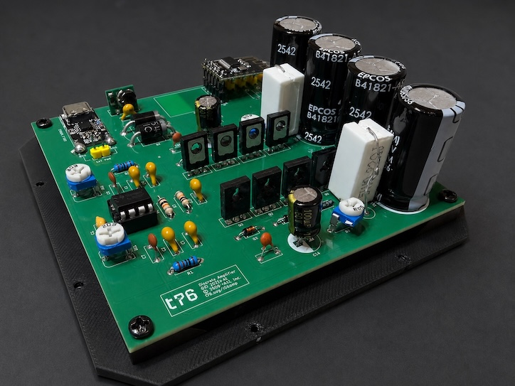

# Amply - a $10 Bluetooth amplifier you'll love

**Amply** is a compact, high-quality audio amplifier and Bluetooth receiver that can be built from roughly $10 worth of widely available parts.

Designed for desktop speakers, it delivers up to 2×10 W into 8 Ω loads while running from an ordinary USB-C power adapter. The entire design uses common, easy-to-source components, making it practical to build almost anywhere.

Despite its low cost, Amply offers surprisingly strong audio performance: THD below 0.015%, excellent linearity, and a flat response extending down to 20 Hz for deep bass, clean mids, and detailed highs.

- [Interactive BOM](./bom/ibom.html)

## Features

- 2-channel Bluetooth 5.0 audio receiver
    - Optional On/Off, muting, pause, next/previous track controls
- Class AB amplifier capable of delivering up to 2×10 W into 8 Ω
- THD (simulated) below 0.015% at 10W
- Nearly-flat frequency response from 20 Hz to 20 kHz
- Powered by a standard USB-C power adapter (5-20 V, 1 A)

## Physical design

- Compact PCB design (100 mm × 100 mm)
- Fully open-source
- Easy to assemble; requires only basic soldering skills and a few common tools
- Uses widely available, low-cost components (total cost around $10)
- 3D-printed enclosure design included in the repository

## Assembly and usage